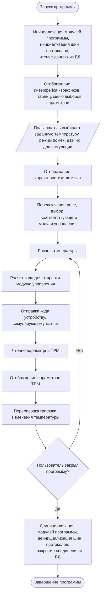

# Алгоритм взаимодействия пользователя с программой

```mermaid
flowchart
    Start(["Запуск программы"]) --> A
    A["Инициализация модулей программы,
    инициализация шин протоколов,
    чтение данных из БД"] --> B1
    B1["Отображение интерфейса - графиков, 
    таблиц, меню выборов параметров"] --> B2 
    B2[/"Пользователь выбирает заданную температуру, 
    режим помех, датчик для симуляции"/] --> C
    C["Отображание характеристики датчика"] --> D
    D["Переключение реле, выбор 
    соответствующего модуля управления"] --> E
    E["Расчет температуры"] --> F
    F["Расчет кода для отправки модулю управления"]  --> G
    G["Отправка кода устройству, симулирующему датчик"] --> H
    H["Чтение параметров ТРМ"] --> I
    I["Отображение параметров ТРМ"] --> J
    J["Перерисовка графика изменения температуры"] --> K
    K{"Пользователь закрыл 
    программу?"} -->|"Нет"| E
    K -->|"Да"| Z     
    Z["Деинициализация модулей программы,
    деинициализация шин протоколов,
    закрытие соединения с БД"] --> End
    End(["Завершение программы"])
```