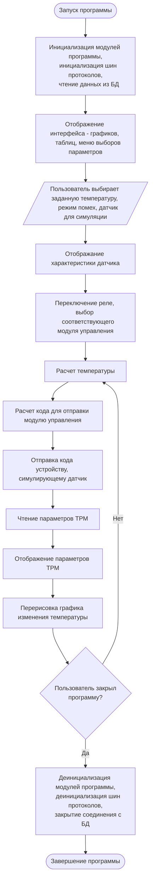
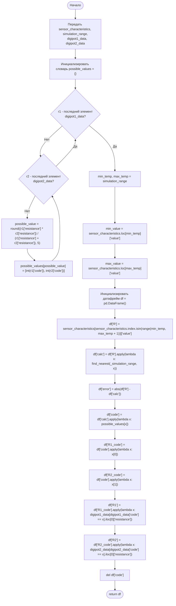
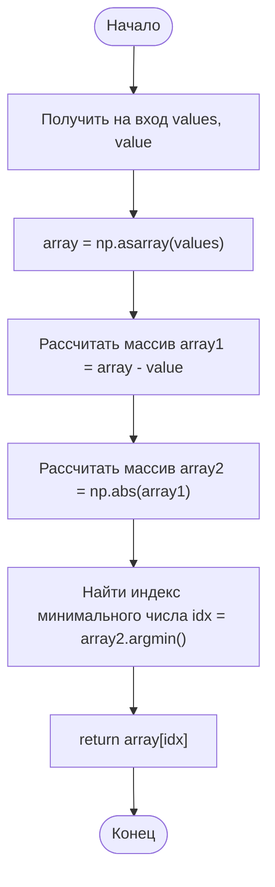

# Алгоритм работы программы

```mermaid
flowchart
    Start(["Начало программы"]) --> A0
    subgraph "Инициализация"
        A0["Открытие соединения с БД"] --> A1
        A1["Чтение списка датчиков из БД"] --> A2
        A2["Инициализация шины SPI"] --> A3
        A3["Инициализация шины I2C"] --> A4
        A4["Инициализация последовательного порта"] --> A5
        A5["Инициализация GPIO портов"] --> A6
        A6["Создание потоков для 
        параллельного выполнения программы"] --> A7
    end
    A7["Инициализация интерфейса"] --> B1
    B1[/"Задание скорости изменения температуры"/] --> B2
    B2[/"Задание температуры окружающей среды"/] --> B3
    B3[/"Задание режима помех"/] --> B
    B[/"Выбор датчика для симуляции из списка"/] --> C1
    C1{"Выбранный датчик 
    - термопара?"} -->|"Да"| C2
    C2["Переключение реле в режим 
    симуляции термопары"] --> C6
    C6["Выбор модуля управления ЦАП"] --> C8
    C1 -->|"Нет"| C3
    C3{"Выбранный датчик -
    термометр 
    сопротивления?"} -->|"Да"| C4
    C3 -->|"Нет"| C5
    C5["Переключение реле в режим 
    симуляции датчика УАС"] --> C6
    C4["Переключение реле в режим 
    симуляции термометра сопротивления"] --> C7
    C7["Выбор модуля управления 
    цифровыми резисторами"] --> C8
    C8["Чтение характеристики датчика из базы данных"] --> C
    C["Отображение характеристики датчика"] --> F
    F["Расчет текущей температуры"] --> G
    G["Расчет кода для отправки модулю отправления"] --> G1
    G1{"Выбран модуль 
    управления ЦАП?"} -->|"Да"| G2
    G1 -->|"Нет"| G3
    G2["Отправка данных ЦАП по шине I2C"] --> H
    G3["Отправка данных цифровым 
    резисторам по шине SPI"] --> H
    H["Чтение параметров ТРМ по протоколу Овен"] --> I1
    I1["Отображение считанных параметров ТРМ"] --> I2
    I2["Перерисовка графика изменения температуры"] --> J
    J{"Пользователь закрыл 
    программу?"} -->|"Да"| K1
    J -->|"Нет"| L
    L{"Пользователь выбрал 
    другой датчик 
    для симуляции?"} -->|"Да"| C1
    L -->|"Нет"| F
    subgraph "Деинициализация"
        K1["Закрытие соединения с БД"] --> K2
        K2["Закрытие последовательного порта"] --> K3
        K3["Деинициализация GPIO портов"] --> K4
        K4["Деинициализация шины SPI"] --> K5
        K5["Деинициализация шины I2C"] --> K6
    end
    K6["Остановка и удаление потоков"] --> End
    End(["Завершение программы"])
```

# Упрощенный алгоритм взаимодействия пользователя с программой

## Алгоритм расчета таблицы для симуляции термометра сопротивления

## Алгоритм нахождения ближайшего значения к `value` в массиве `values`

