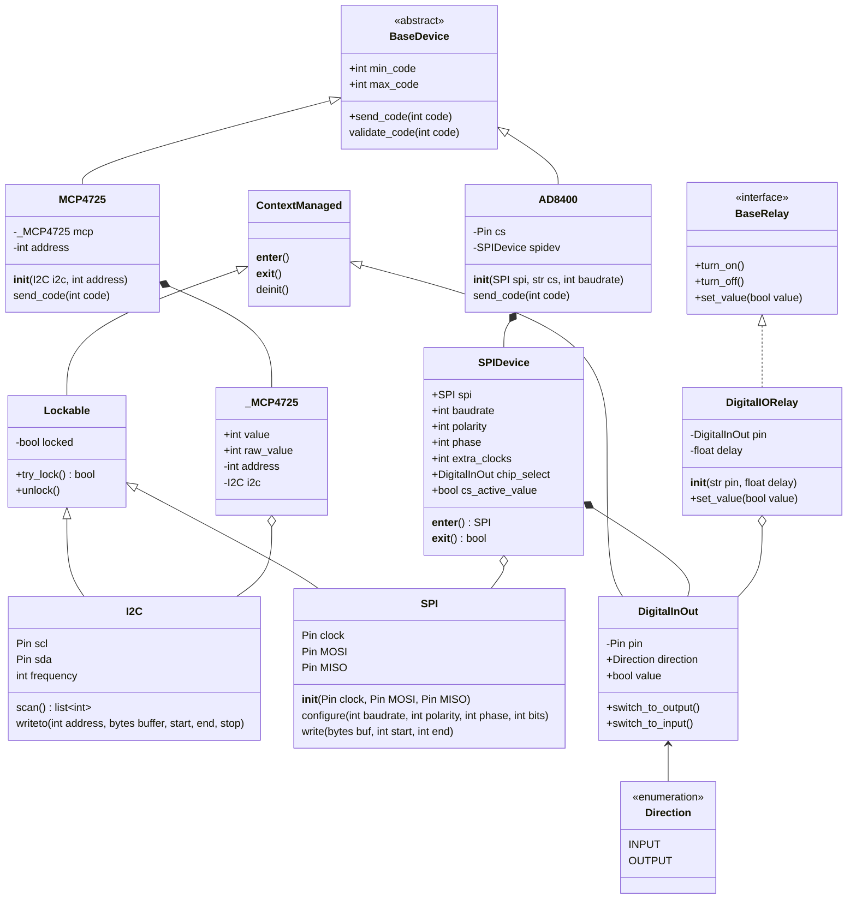
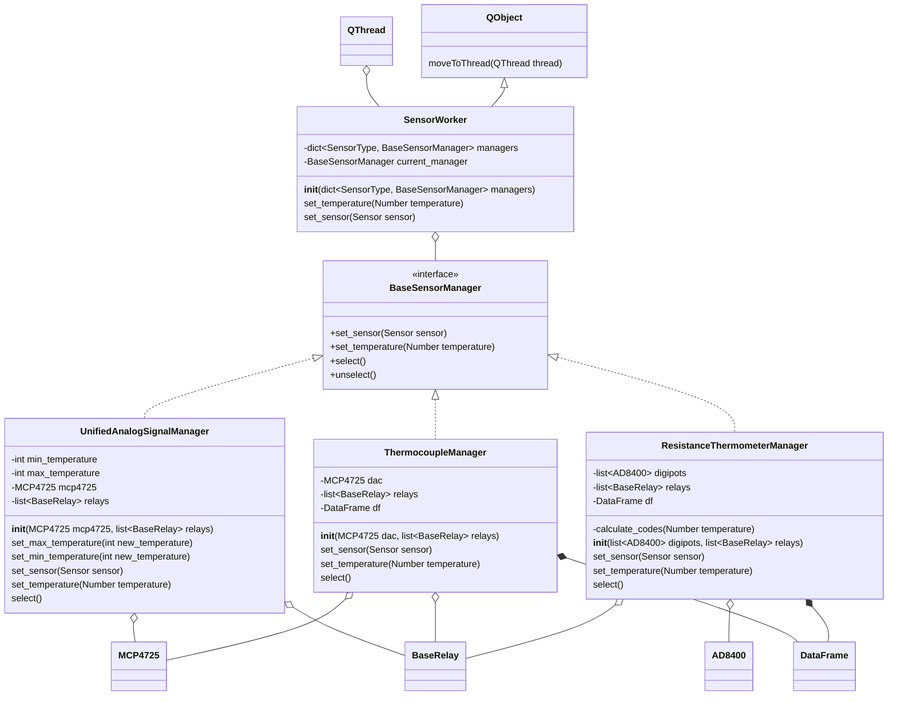
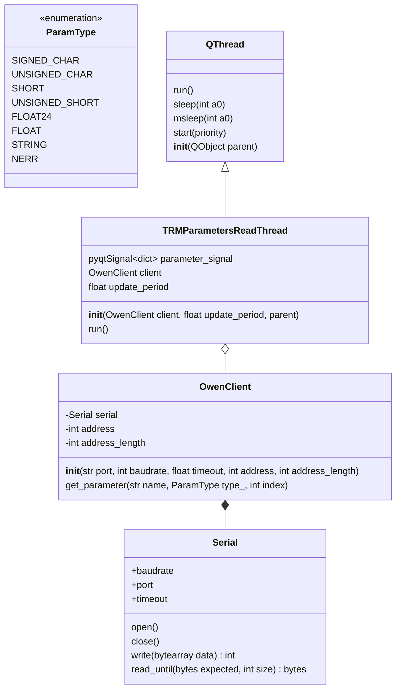
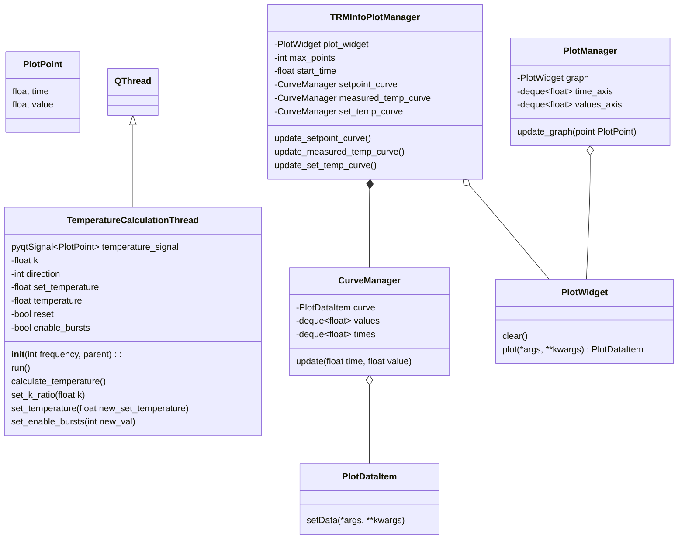
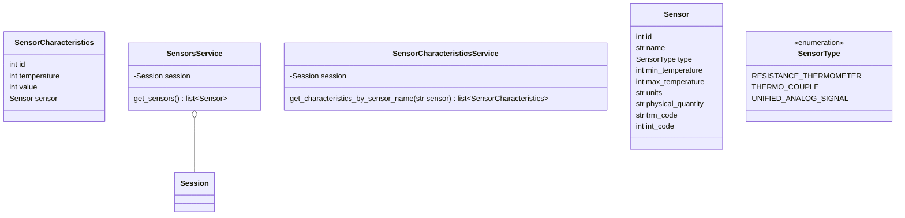
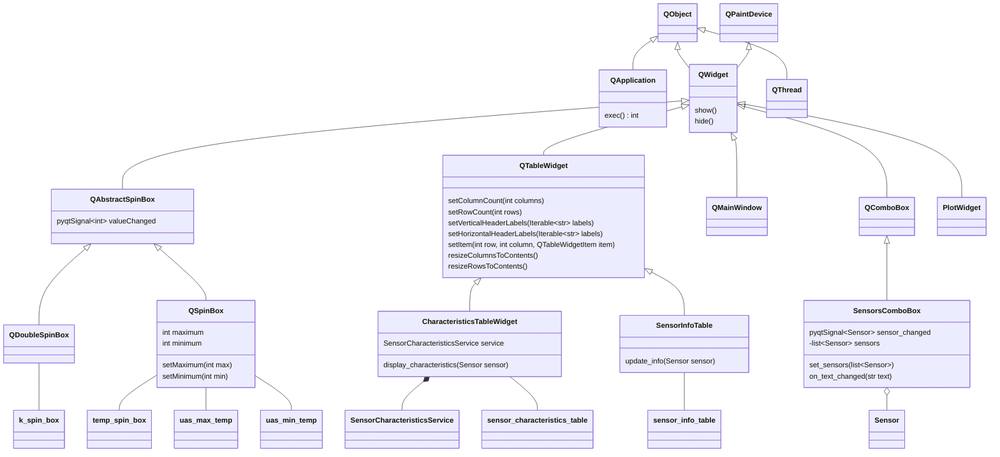

# Диаграммы классов программы

## Протоколы, шины, периферия

```mermaid
classDiagram
    class BaseDevice {
        <<abstract>>
        +int min_code
        +int max_code
        +send_code(int code)
        validate_code(int code)
    }
    
    class AD8400 {
        __init__(SPI spi, str cs, int baudrate)
        -Pin cs
        -SPIDevice spidev
        send_code(int code)
    }
    
    class MCP4725 {
        -_MCP4725 mcp 
        -int address
        __init__(I2C i2c, int address)
        send_code(int code)
    }
    
    class BaseRelay {
    <<interface>>
        +turn_on()
        +turn_off()
        +set_value(bool value)
    }
    
    class DigitalIORelay {
        -DigitalInOut pin
        -float delay
        __init__(str pin, float delay)
        +set_value(bool value)
    }
    
    class I2C {
        Pin scl
        Pin sda
        int frequency
        scan() list~int~
        writeto(int address, bytes buffer, start, end, stop)
    }
    
    class SPI {
        Pin clock
        Pin MOSI
        Pin MISO
        __init__(Pin clock, Pin MOSI, Pin MISO)
        configure(int baudrate, int polarity, int phase, int bits)
        write(bytes buf, int start, int end)
    }
    
    class Lockable {
        -bool locked
        +try_lock() bool
        +unlock()
    }
    
    class ContextManaged {
        __enter__()
        __exit__()
        deinit()
    }
    
    class SPIDevice{
        +SPI spi
        +int baudrate
        +int polarity
        +int phase
        +int extra_clocks
        +DigitalInOut chip_select
        +bool cs_active_value
        __enter__() SPI
        __exit__() bool
    }

    class _MCP4725 {
        +int value
        +int raw_value
        -int address
        -I2C i2c
    }
    
    class DigitalInOut {
        -Pin pin
        +Direction direction
        +bool value
        +switch_to_output()
        +switch_to_input()
    } 
    
    class Direction {
        <<enumeration>>
        INPUT
        OUTPUT
    }
   
    BaseDevice <|-- AD8400
    BaseDevice <|-- MCP4725
    ContextManaged <|-- Lockable
    ContextManaged <|-- DigitalInOut
    DigitalInOut <-- Direction 
    Lockable <|-- I2C
    Lockable <|-- SPI
    AD8400 *-- SPIDevice
    SPIDevice o-- SPI
    MCP4725 *-- _MCP4725
    _MCP4725 o-- I2C
    BaseRelay <|.. DigitalIORelay
    SPIDevice *-- DigitalInOut
    DigitalIORelay o-- DigitalInOut
```

## Управление симуляторами датчиков

```mermaid
classDiagram

    class SensorWorker {
        -dict~SensorType, BaseSensorManager~ managers 
        -BaseSensorManager current_manager 
        __init__(dict~SensorType, BaseSensorManager~ managers)
        set_temperature(Number temperature)
        set_sensor(Sensor sensor)
    }
    
    class QObject {
        moveToThread(QThread thread)
    }
    
    class BaseSensorManager {
        <<interface>>
        +set_sensor(Sensor sensor)
        +set_temperature(Number temperature)
        +select()
        +unselect()   
    }
    
    class UnifiedAnalogSignalManager {
        -int min_temperature 
        -int max_temperature
        -MCP4725 mcp4725 
        -list~BaseRelay~ relays
        __init__(MCP4725 mcp4725, list~BaseRelay~ relays)
        set_max_temperature(int new_temperature)
        set_min_temperature(int new_temperature)
        set_sensor(Sensor sensor)
        set_temperature(Number temperature)
        select()
    }
    
    class ResistanceThermometerManager {
        -list~AD8400~ digipots
        -list~BaseRelay~ relays
        -DataFrame df
        -calculate_codes(Number temperature)
        __init__(list~AD8400~ digipots, list~BaseRelay~ relays)
        set_sensor(Sensor sensor)
        set_temperature(Number temperature)
        select()
    }
    class ThermocoupleManager {
        -MCP4725 dac
        -list~BaseRelay~ relays
        -DataFrame df
        __init__(MCP4725 dac, list~BaseRelay~ relays)
        set_sensor(Sensor sensor)
        set_temperature(Number temperature)
        select()
    }
  
    QObject <|-- SensorWorker
    QThread o-- SensorWorker
    SensorWorker o-- BaseSensorManager
    BaseSensorManager <|.. UnifiedAnalogSignalManager
    BaseSensorManager <|.. ResistanceThermometerManager
    BaseSensorManager <|.. ThermocoupleManager
    ResistanceThermometerManager o-- BaseRelay
    ResistanceThermometerManager o-- AD8400
    ResistanceThermometerManager *-- DataFrame
    ThermocoupleManager o-- MCP4725
    ThermocoupleManager o-- BaseRelay
    ThermocoupleManager *-- DataFrame
    UnifiedAnalogSignalManager o-- MCP4725
    UnifiedAnalogSignalManager o-- BaseRelay
```

## Протокол Овен

```mermaid
classDiagram
    
    class OwenClient {
        -Serial serial
        -int address
        -int address_length
        __init__(str port, int baudrate, float timeout, int address, int address_length)
        get_parameter(str name, ParamType type_, int index)
    }
    
    class Serial {
        +baudrate
        +port
        +timeout
        open()
        close()
        write(bytearray data) int
        read_until(bytes expected, int size) bytes
    }
    
    class ParamType {
        <<enumeration>>
        SIGNED_CHAR
        UNSIGNED_CHAR
        SHORT
        UNSIGNED_SHORT
        FLOAT24
        FLOAT
        STRING
        NERR        
    }
    
    class TRMParametersReadThread {
        pyqtSignal~dict~ parameter_signal
        OwenClient client
        float update_period
        __init__(OwenClient client, float update_period, parent)
        run()
    }
    
    class QThread {
        run()
        sleep(int a0)
        msleep(int a0)
        start(priority)
        __init__(QObject parent)
    }
    
    OwenClient *-- Serial
    QThread <|-- TRMParametersReadThread
    TRMParametersReadThread o-- OwenClient 
```

## Графики, расчёты

```mermaid
classDiagram
    
    class TemperatureCalculationThread {
        pyqtSignal~PlotPoint~ temperature_signal
        -float k
        -int direction
        -float set_temperature
        -float temperature
        -bool reset
        -bool enable_bursts 
        __init__(int frequency, parent):
        run()
        calculate_temperature()
        set_k_ratio(float k)
        set_temperature(float new_set_temperature)
        set_enable_bursts(int new_val)
    }
    
    class PlotPoint{
        float time
        float value
    }
    
    class PlotManager {
        -PlotWidget graph
        -deque~float~ time_axis
        -deque~float~ values_axis
        update_graph(point PlotPoint)
    }
    
    class CurveManager {
        -PlotDataItem curve
        -deque~float~ values
        -deque~float~ times
        update(float time, float value)
    }
    
    class TRMInfoPlotManager {
        -PlotWidget plot_widget
        -int max_points
        -float start_time
        -CurveManager setpoint_curve
        -CurveManager measured_temp_curve
        -CurveManager set_temp_curve
        update_setpoint_curve()       
        update_measured_temp_curve()       
        update_set_temp_curve()       
    }
    
    class PlotWidget {
        clear()
        plot(*args, **kwargs) PlotDataItem
    }
    
    class PlotDataItem {
        setData(*args, **kwargs)
    }
    
    QThread <|-- TemperatureCalculationThread
    TRMInfoPlotManager *-- CurveManager
    TRMInfoPlotManager o-- PlotWidget
    PlotManager o-- PlotWidget
    CurveManager o-- PlotDataItem
```

## Взаимодействие с БД

```mermaid
classDiagram

    class SensorCharacteristics {
        int id
        int temperature
        int value
        Sensor sensor
    }
    
    class SensorsService {
        -Session session
        get_sensors() list~Sensor~
    }
    
    class SensorCharacteristicsService {
        -Session session
        get_characteristics_by_sensor_name(str sensor) list~SensorCharacteristics~
    }

    class Sensor {
        int id
        str name
        SensorType type
        int min_temperature
        int max_temperature
        str units
        str physical_quantity
        str trm_code
        int int_code
    }
    
    class SensorType {
        <<enumeration>>
        RESISTANCE_THERMOMETER
        THERMO_COUPLE
        UNIFIED_ANALOG_SIGNAL
    }

    SensorsService o-- Session
```

## Интерфейс

```mermaid
classDiagram

    class SensorsComboBox {
        pyqtSignal~Sensor~ sensor_changed
        -list~Sensor~ sensors
        set_sensors(list~Sensor~)
        on_text_changed(str text)
    }
    
    class CharacteristicsTableWidget {
        SensorCharacteristicsService service
        display_characteristics(Sensor sensor)
    }
    
    class SensorInfoTable{
        update_info(Sensor sensor)
    }
    
    class QAbstractSpinBox {
        pyqtSignal~int~ valueChanged
    }
    
    class QApplication {
        exec() int
    }
    
    class QWidget {
        show()
        hide()
    }

    class QSpinBox {
        int maximum
        int minimum
        setMaximum(int max)
        setMinimum(int min)
    }
    
    class QTableWidget {
        setColumnCount(int columns)
        setRowCount(int rows)
        setVerticalHeaderLabels(Iterable~str~ labels)
        setHorizontalHeaderLabels(Iterable~str~ labels)
        setItem(int row, int column, QTableWidgetItem item)
        resizeColumnsToContents()
        resizeRowsToContents()
    }
    
    class QMainWindow
    class QDoubleSpinBox 
    class k_spin_box
    class temp_spin_box
    class sensor_characteristics_table
    class sensor_info_table
    class uas_max_temp
    class uas_min_temp
    
    QComboBox <|-- SensorsComboBox
    SensorsComboBox o-- Sensor
    QTableWidget <|-- CharacteristicsTableWidget
    QTableWidget <|-- SensorInfoTable
    CharacteristicsTableWidget *-- SensorCharacteristicsService
    QAbstractSpinBox <|-- QDoubleSpinBox
    QAbstractSpinBox <|-- QSpinBox
    QDoubleSpinBox -- k_spin_box
    QSpinBox -- temp_spin_box
    CharacteristicsTableWidget -- sensor_characteristics_table
    SensorInfoTable -- sensor_info_table
    QSpinBox -- uas_max_temp
    QSpinBox -- uas_min_temp
    QObject <|-- QApplication 
    QWidget <|-- QAbstractSpinBox
    QWidget <|-- QTableWidget
    QWidget <|-- QComboBox
    QWidget <|-- QMainWindow
    QWidget <|-- PlotWidget
    QObject <|-- QWidget
    QPaintDevice <|-- QWidget
    QObject <|-- QThread
```
