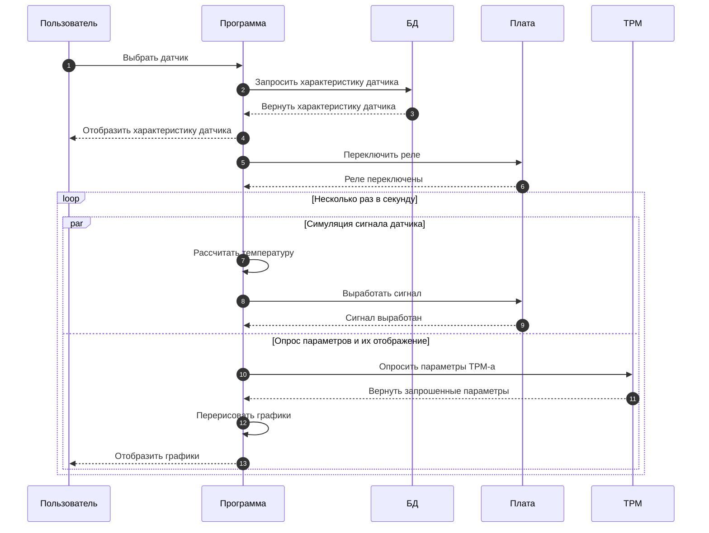
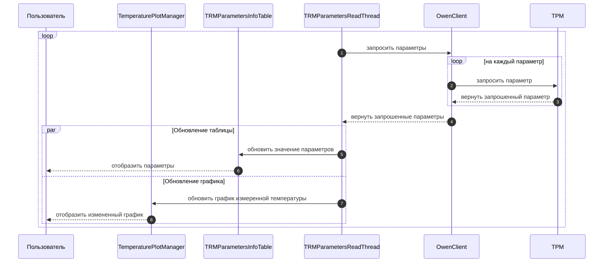
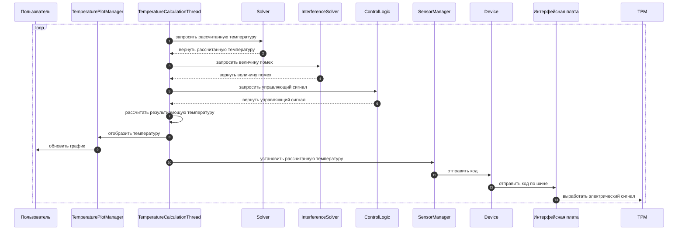

# Диаграммы последовательностей

## Обобщенная последовательность работы приложения

```mermaid
sequenceDiagram
    autonumber
    participant Пользователь
    participant Программа
    participant БД
    participant Плата
    participant ТРМ
    Пользователь ->> Программа: Выбрать датчик
    Программа ->> БД: Запросить характеристику датчика
    БД -->> Программа: Вернуть характеристику датчика
    Программа -->> Пользователь: Отобразить характеристику датчика
    Программа ->> Плата: Переключить реле
    Плата -->> Программа : Реле переключены
    loop Несколько раз в секунду
        par Симуляция сигнала датчика
            Программа ->> Программа: Расcчитать температуру
            Программа ->> Плата: Выработать сигнал
            Плата -->> Программа: Сигнал выработан
        and Опрос параметров и их отображение
            Программа ->> ТРМ: Опросить параметры ТРМ-а
            ТРМ -->> Программа: Вернуть запрошенные параметры
            Программа ->> Программа: Перерисовать графики
            Программа -->> Пользователь : Отобразить графики 
        end
    end
```

## Последовательность чтения параметров ТРМ

```mermaid
sequenceDiagram
    autonumber
    participant Пользователь
    participant TemperaturePlotManager
    participant TRMParametersInfoTable
    participant TRMParametersReadThread
    participant OwenClient
    participant ТРМ

    loop
        TRMParametersReadThread ->> OwenClient : запросить параметры
        loop на каждый параметр
            OwenClient ->> ТРМ : запросить параметр
            ТРМ -->> OwenClient : вернуть запрошенный параметр
        end
        OwenClient -->> TRMParametersReadThread : вернуть запрошенные параметры
        par Обновление таблицы    
            TRMParametersReadThread ->> TRMParametersInfoTable : обновить значение параметров
            TRMParametersInfoTable -->> Пользователь : отобразить параметры
        and Обновление графика
            TRMParametersReadThread ->> TemperaturePlotManager : обновить график измеренной температуры  
            TemperaturePlotManager -->> Пользователь : отобразить измененный график
        end
    end
```

## Последовательность расчета температуры

```mermaid
sequenceDiagram
    autonumber
    participant Пользователь
    participant TemperaturePlotManager
    participant TemperatureCalculationThread
    participant Solver
    participant InterferenceSolver
    participant ControlLogic
    participant SensorManager
    participant Device
    participant Интерфейсная плата
    participant ТРМ

    loop
        TemperatureCalculationThread ->> Solver : запросить рассчитанную температуру
        Solver -->> TemperatureCalculationThread : вернуть рассчитанную температуру
        TemperatureCalculationThread ->> InterferenceSolver : запросить величину помех
        InterferenceSolver -->> TemperatureCalculationThread : вернуть величину помех
        TemperatureCalculationThread ->> ControlLogic : запросить управляющий сигнал
        ControlLogic -->> TemperatureCalculationThread : вернуть управляющий сигнал
        TemperatureCalculationThread ->> TemperatureCalculationThread : рассчитать результирующую температуру
        TemperatureCalculationThread ->> TemperaturePlotManager : отобразить температуру
        TemperaturePlotManager ->> Пользователь : обновить график
        TemperatureCalculationThread ->> SensorManager : установить рассчитанную температуру
        SensorManager ->> Device : отправить код
        Device ->> Интерфейсная плата : отправить код по шине
        Интерфейсная плата ->> ТРМ : выработать электрический сигнал
    end
```