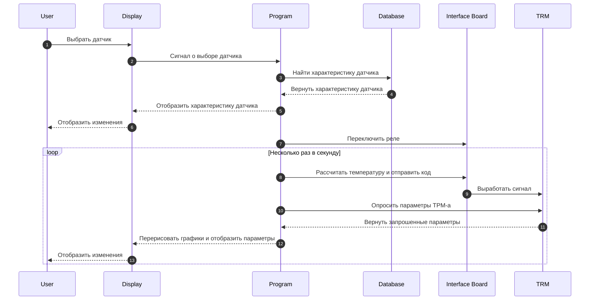

```mermaid
sequenceDiagram
    autonumber
    participant User
    participant Display
    participant Program
    participant Database
    participant Interface Board
    participant TRM
    User ->> Display: Выбрать датчик
    Display ->> Program: Сигнал о выборе датчика
    Program ->> Database: Найти характеристику датчика
    Database -->> Program: Вернуть характеристику датчика
    Program -->> Display: Отобразить характеристику датчика
    Display -->> User: Отобразить изменения
    Program ->> Interface Board: Переключить реле
    loop Несколько раз в секунду
        Program ->> Interface Board: Расcчитать температуру и отправить код
        Interface Board ->> TRM: Выработать сигнал
        Program ->> TRM: Опросить параметры ТРМ-а
        TRM -->> Program: Вернуть запрошенные параметры
        Program -->> Display: Перерисовать графики и отобразить параметры
        Display -->> User: Отобразить изменения
    end
```

