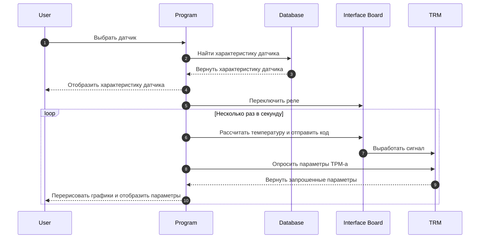

```mermaid
sequenceDiagram
    autonumber
    participant User
    participant Program
    participant Database
    participant Interface Board
    participant TRM
    User ->> Program: Выбрать датчик
    Program ->> Database: Найти характеристику датчика
    Database -->> Program: Вернуть характеристику датчика
    Program -->> User: Отобразить характеристику датчика
    Program ->> Interface Board: Переключить реле
    loop Несколько раз в секунду
        Program ->> Interface Board: Расcчитать температуру и отправить код
        Interface Board ->> TRM: Выработать сигнал
        Program ->> TRM: Опросить параметры ТРМ-а
        TRM -->> Program: Вернуть запрошенные параметры
        Program -->> User: Перерисовать графики и отобразить параметры
    end
```

