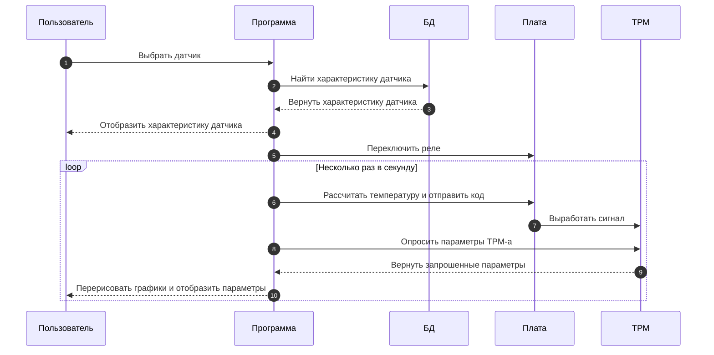

```mermaid
sequenceDiagram
    autonumber
    participant Пользователь
    participant Программа
    participant БД
    participant Плата
    participant ТРМ
    Пользователь ->> Программа: Выбрать датчик
    Программа ->> БД: Найти характеристику датчика
    БД -->> Программа: Вернуть характеристику датчика
    Программа -->> Пользователь: Отобразить характеристику датчика
    Программа ->> Плата: Переключить реле
    loop Несколько раз в секунду
        Программа ->> Плата: Расcчитать температуру и отправить код
        Плата ->> ТРМ: Выработать сигнал
        Программа ->> ТРМ: Опросить параметры ТРМ-а
        ТРМ -->> Программа: Вернуть запрошенные параметры
        Программа -->> Пользователь: Перерисовать графики и отобразить параметры
    end
```

